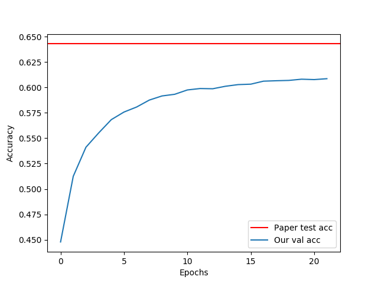

## Dual Attention Networks for Visual Question Answering

This is a PyTorch implementation of [Dual Attention Networks for Multimodal Reasoning and Matching](https://arxiv.org/pdf/1611.00471.pdf).  I forked the code from [Cyanogenoid](https://github.com/Cyanogenoid)'s [pytorch-vqa](https://github.com/Cyanogenoid/pytorch-vqa) and replaced the model with my implementation of Dual Attention Networks because doing all the data preprocessing and loading stuff is kinda nasty. Please see [pytorch-vqa](https://github.com/Cyanogenoid/pytorch-vqa) on how the data was preprocessed and extracted.

Differences between paper and this model
- Learning rate decay: the original paper halved the learning after 30 epochs and trained for another 30 epochs.  we used the forked code optimization and halved learning rate after 50k iterations.
- Answer scoring: the original paper used only a single layer to score the answers with the memory vector.  Our implementation uses a 2 layer network.
- Pretrained word embeddings:  the original paper used 512 as word embedding dimension.  For the below graph, we used 300 and load pretrained Glove vectors.

Our implementation reaches around 61% validation accuracy after running 20 epochs. 

### Requirements

Python version 3
- h5py
- torch
- torchvision
- tqdm
- torchtext

Plotting
- numpy
- matplotlib
